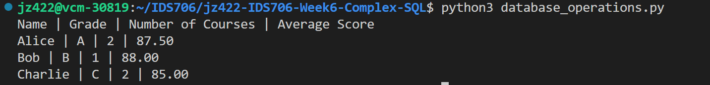

# IDS706-Week5-miniProj-SQLite
[](https://github.com/Jingzhi-cyber/jz422-IDS706-Week6-Complex-SQL/actions/workflows/cicd.yml)

This repository sets up an environment on CodeSpaces and uses GitHub Actions to run a Makefile for the following commands: make install, make test, make format, and make lint.

## Getting Started
To set up the project, simply run make all or run make install and make test.

## Interact with SQLite database
This project showcases the interaction between a Python script and an SQLite database. The operations include connecting to the database, performing CRUD (Create, Read, Update, Delete) operations, and running custom SQL queries.

## How to Run
1. Ensure Python3 is installed.
2. Run the script using `python3 database_operations.py` or `python database_operations.py > output_log.txt`.
3. Check the terminal or `output_log.txt` for results.

## Features
- Connect to SQLite database.
- CRUD operations on a `students` table.
- Sample queries fetching and counting data.

## Script Walkthrough
1. Establishing a Connection:
    The script begins by connecting to an SQLite database named `students.db`. If the database doesn't exist, it gets created.
    ```
    def connect_to_database(db_name="students.db"):
        return sqlite3.connect(db_name)
    ```

2. CRUD Operations:
    Create - A table named students gets created with the columns: id, name, and grade.
    ```
    def create_table(cursor):
    cursor.execute(
        """CREATE TABLE IF NOT EXISTS students
                      (id INTEGER PRIMARY KEY, name TEXT, grade TEXT)"""
    )
    ```    
    Read - Fetch details of a student based on their name.
    ```
    def read_student(cursor, name):
        cursor.execute("SELECT * FROM students WHERE name=?", (name,))
        return cursor.fetchall()
    ```
    Update - Modify the grade of a student.
    ```
    def update_student_grade(cursor, name, grade):
        cursor.execute("UPDATE students SET grade=? WHERE name=?", (grade, name))
    ```
    Delete - Remove a student's record based on their name.
    ```
    def delete_student(cursor, name):
        cursor.execute("DELETE FROM students WHERE name=?", (name,))
    ```

3. Custom SQL Queries:
    The script also contains two custom SQL queries:

    Counting students based on a grade.
    ```
    def count_students_by_grade(cursor, grade):
        cursor.execute("SELECT COUNT(*) FROM students WHERE grade=?", (grade,))
        return cursor.fetchone()
    ```

    Fetching student data ordered by their name.
    ```
    def fetch_students_ordered_by_name(cursor):
        cursor.execute("SELECT * FROM students ORDER BY name")
        return cursor.fetchall()
    ```
4. Viewing Results
    Run `python3 database_operations.py` to see the results on the terminal:
     


## Project Structure
- **.devcontainer** includes a Dockerfile and devcontainer.json. The **Dockerfile** within this folder specifies how the container should be built, and other settings in this directory may control development environment configurations.
- **workflows** includes GitHub Actions, which contain configuration files for setting up automated build, test, and deployment pipelines for your project.
- **.gitignore** is used to specify which files or directories should be excluded from version control when using Git.
- **Makefile** is a configuration file used in Unix-based systems for automating tasks and building software. It contains instructions and dependencies for compiling code, running tests, and other development tasks.
- **README.md** is the instruction file for the readers.
- **requirements.txt** is to specify the dependencies (libraries and packages) required to run the project.
- **test_main.py** is a test file for main.py that can successfully run in IDEs.
- **main.py** is a Python file that contains the main function.
- **database_operations.py** is the main Python script that contains functions to connect to the database, perform CRUD operations, and execute custom SQL queries.
- **students.db** is a SQLite database file. It will be automatically generated after the first script execution and will store the students table along with its records.